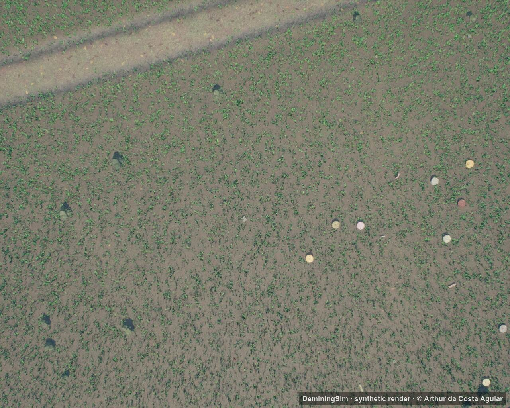
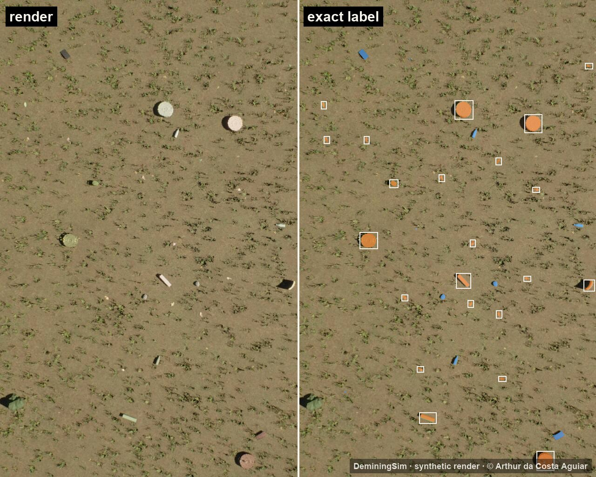
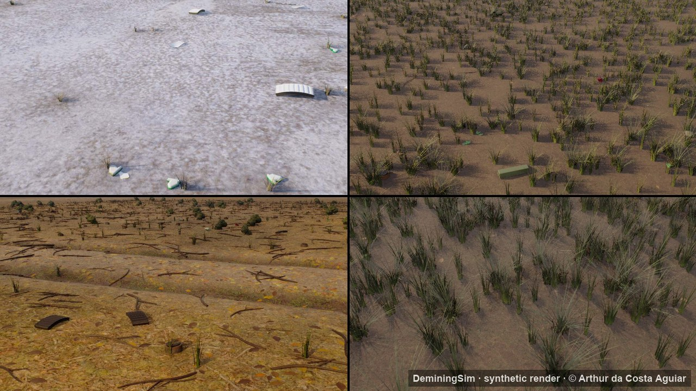
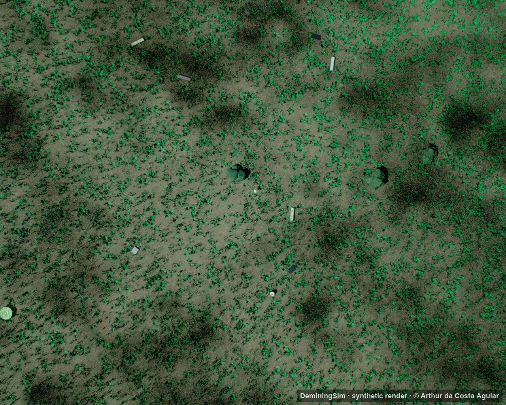

# DeminingSim

**Synthetic training data for surface-landmine detection in drone and handheld imagery**

Arthur da Costa Aguiar, M.Sc. · Klaus, Austria · arthuraguiar.eng@gmail.com
Independent humanitarian research project · 2026

---

## What it is

DeminingSim is a simulation-based system that produces labelled training images for detecting surface landmines and explosive remnants of war. It was built to address a practical bottleneck in humanitarian mine action: real, labelled images of each mine type, terrain and season are scarce, expensive and dangerous to collect.

This repository is a **results showcase**. The generator, its source code, assets and generation pipeline are **not published**.

## Key results

Evaluated on three public real-world datasets from different countries and sensors.

| Result | Value |
| --- | --- |
| Modern detector trained on synthetic data only, tested on real drone imagery | **mAP50 0.88** |
| Synthetic data combined with real photos, hardest class (small metal anti-personnel mines) | **+8 points** |
| Value of synthetic pre-training when only 5–25% of real photos are available | **worth 1.3–2.3× more real data** |
| Improvement from one simulation design choice, synthetic-only, out-of-domain | **0.26 → 0.51 mAP50** |

**Scale of the evaluation:** ~23,000 synthetic images · 10 experiments · ~180 detector trainings · 3 seeds per data point · paired statistical comparison with confidence intervals.

## Synthetic scenes

All images below are synthetic renders, downscaled and watermarked.

**Exact labels come for free.** Every object in a generated scene is labelled at the pixel level, including partly hidden ones. Left: render. Right: mines (orange, boxed) and look-alike clutter such as cans and scrap (blue).

**Many terrains and seasons.** Snow, steppe, dry field with branches and grassland.

**Drone view with distractors.** Small objects in cratered grassland, mixed with look-alike debris.

## Scope and ethics

- Strictly humanitarian: the work supports detection and clearance, nothing else.
- Mine models reproduce external appearance only, for visual detection.
- No real-world data is redistributed here; public datasets remain under their own licences.

## Availability

The generator, code, assets, an offline evaluation kit for mine-action organisations and the full technical report are **available on request** for research collaboration, academic review or partnerships with NGOs.

Contact: arthuraguiar.eng@gmail.com · [linkedin.com/in/arthur-c-aguiar-processoseprojetos](https://www.linkedin.com/in/arthur-c-aguiar-processoseprojetos/)

© 2026 Arthur da Costa Aguiar. All rights reserved, including the images. No licence is granted to reuse the material in this repository without written permission.
